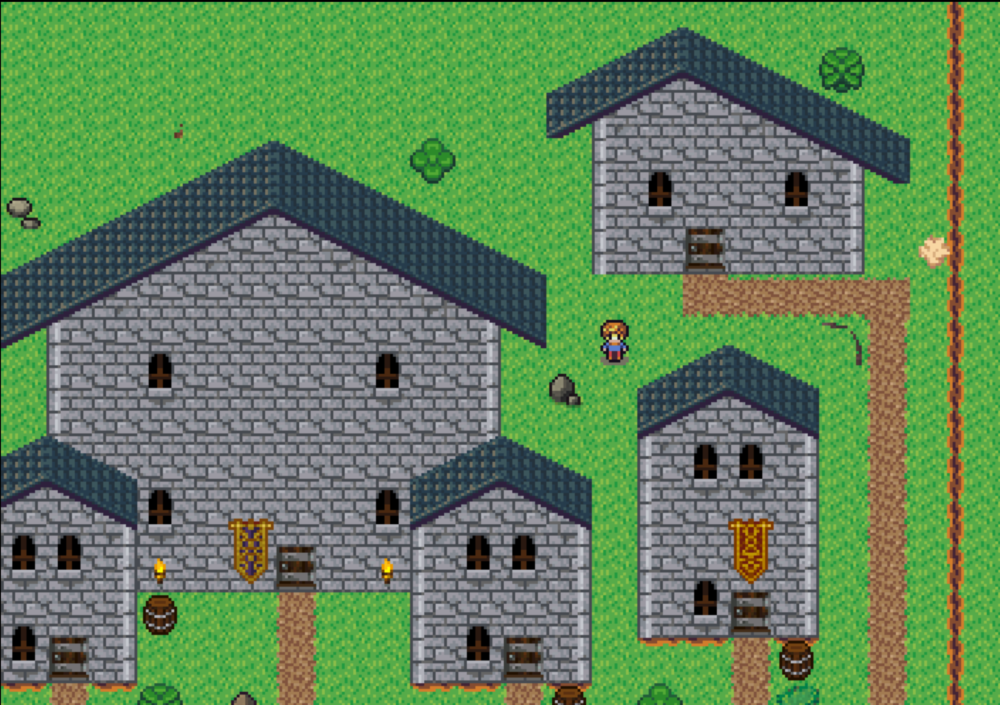

# About
This is an engine for a top-down story-based rpg with 16px square tiles.  It is based on Phaser, but it does not use the tilemap feature.  Instead it includes a tilemap level editor, which builds a custom tilemap file, a JSON file.
Long-term developement plans include a system for simple cut scene animations, combat, weapons, magic, and stat progress - all relying on JSON files for their data.
#Map Editor
Currently, the map defaults to a 50x50 blank grid.  Running the blankGrid() function from the console will allow creation of an arbitrary sized grid.
## P - Passables
Passables allow for blocking player movement.  Select the proper icon to block the right or bottom path from the tile.  They can be combined.  The blank square clears both paths.  (Blocking the bottom, also blocks movement from the square below, as does right to left.)
## S - Structures
The structures menu is populated with the tile graphics.  Most of these come from opengameart.  See the atributions.txt file for more information.  You can place and combine them with the mouse, after selecting your texture.  Dragging will create a rectangular pattern of them.  CTRL-Left/Right to switch pages.
## E - Extras
This menu allows you to add events and an event key, or select an area of the map.  Once selected, the area can be deleted (backspace), cut (ctrl-x), or copied (crtl-c).  Once an area is copied to the clipboard, pressing ctrl-v will paste the structure blocks at the mouselocation.
## N - NPCs
After adding an NPC texture to a square, you can set its key name.  This corresponds to its json filename in the data/dialog/ folder.
## Controls
Use the arrow keys to move around.  Scrolling your mouse will zoom the view in and out, but zooming out will slow down movement significantly.  CTRL-Left/Right will allow you to switch pages in the Structures menu. CTRL-S to save and download the file to your computer.  You can drag the file onto the editor window to load the file.
# Game
I am currently working on an introduction/tutorial.
Use arrow keys to move and space to select.  I have also added limited gamepad support for Xbox 360 class controllers.  Pressing space on the map will allow you to open up the menu.  The menu currently allows access to a basic item screen, which allows you to use items, and a talk option, to open dialog with the npc your character is facing.
The dialog system in the game allows for quests with multiple parts, as well as shopping, and the exectution of events.
